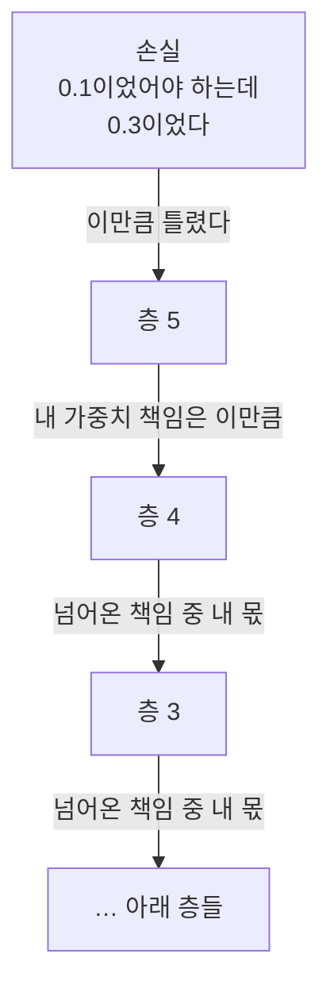
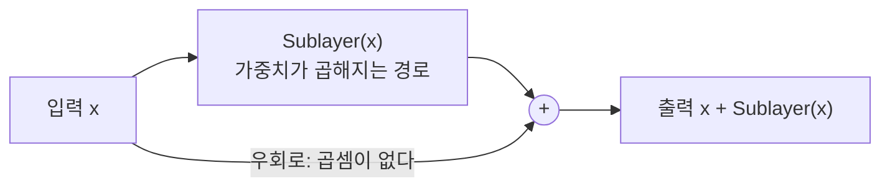
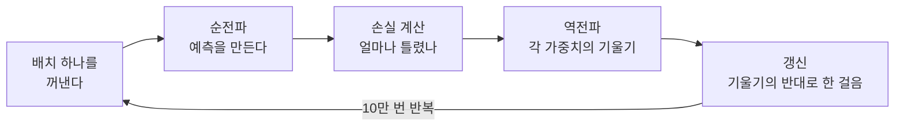

앞선 글들에서 임베딩과 신경망이 결국 수천억 개의 가중치(W, b)로 이뤄진 함수라는 걸 봤다.
그럼 그 숫자들은 누가 정할까. 사람이 하나하나 정하는 건 불가능하다. 그래서:

> 처음엔 아무 숫자나 넣는다. 그리고 **틀린 만큼 조금씩 고친다.**

이게 학습의 전부다. 나머지는 "틀렸다"를 어떻게 재고 "조금씩 고친다"를 어떻게
하느냐의 문제다. 이 글에서는 그 과정을 손실 → 기울기 → 역전파 순으로 정리한다.

## 1단계: 손실 (얼마나 틀렸나)

입력이 `"앱이 느려서 사용자가 그것을"`이고 정답이 `"지웠다"`일 때, 모델이 이렇게 답했다고 하자.

| 후보 | 모델이 준 확률 |
|---|---|
| **지웠다** (정답) | **0.10** |
| 샀다 | 0.30 |
| 먹었다 | 0.25 |

정답에 0.10밖에 안 줬으니 많이 틀렸다.

> **정답에 준 확률이 낮을수록 손실이 크다.**

정답 토큰에 준 확률을 $$p_y$$라 하면, 손실은 그 확률에 로그를 씌워 부호를 뒤집은 값이다.

$$
L = -\log p_y
$$

로그를 몰라도 된다. 이 함수가 하는 일은 표 하나로 드러난다.

| 정답에 준 확률 $$p_y$$ | 손실 $$-\log p_y$$ |
|---|---|
| 0.9 | 0.11 |
| 0.5 | 0.69 |
| 0.1 | 2.30 |
| 0.01 | 4.61 |

확률이 1에 가까우면 손실이 0에 붙고, 0에 가까워지면 손실이 급격히 치솟는다.
**정답을 자신 있게 틀릴수록 크게 혼난다.**

목표가 명확해졌다: **이 숫자를 최소로 만드는 W와 b를 찾기.**

## 2단계: 기울기 (어느 방향으로 고칠까)

가중치가 하나뿐이라고 단순화하면:

왼쪽 비탈이면 오른쪽으로, 오른쪽 비탈이면 왼쪽으로 가야 한다.
**지금 서 있는 자리의 기울기만 알면 방향을 알 수 있다.**

이 기울기가 **그래디언트(gradient)**다. 미분으로 구하지만,
미분을 몰라도 이렇게 이해하면 충분하다:

> 이 가중치를 조금 늘리면 손실이 늘어나는가 줄어드는가, 그리고 얼마나.

기호로는 가중치 $$w$$에 대한 손실의 변화율, 즉 $$\dfrac{\partial L}{\partial w}$$라고 쓴다.
부호만 보면 할 일이 정해진다.

| $$\partial L / \partial w$$ | 늘리면 손실이 | 그래서 |
|---|---|---|
| 양수 | 늘어난다 | 가중치를 줄인다 |
| 음수 | 줄어든다 | 가중치를 늘린다 |

**갱신 규칙**은 이 둘을 한 줄로 합친 것이다. $$\eta$$가 학습률이다.

$$
w \leftarrow w - \eta \frac{\partial L}{\partial w}
$$

부호가 어느 쪽이든 빼주기만 하면 기울기의 반대 방향으로 이동한다.
이게 **경사하강법**이다.

### 학습률 = 보폭

| 학습률 $$\eta$$ | 벌어지는 일 |
|---|---|
| 너무 크면 | 최저점을 뛰어넘어 왔다갔다. 발산 |
| 너무 작으면 | 제자리걸음. 학습이 끝나지 않음 |

**논문 5.3절**이 이 이야기다. 학습률을 고정하지 않고 훈련 중에 바꿨다.

- 초반 4000스텝(warmup_steps): 학습률을 **선형으로 증가**
- 이후: 스텝 수의 **제곱근에 반비례해 감소**

처음엔 가중치가 무작위라 큰 보폭이면 엉뚱한 데로 튄다(살살 시작).
자리를 잡으면 과감하게, 최저점 근처에선 다시 줄여 정밀 착지.

$$
\eta = d_{\text{model}}^{-0.5} \cdot \min\left(\text{step}^{-0.5},\ \text{step} \cdot \text{warmup}^{-1.5}\right)
$$

논문의 복잡해 보이는 식(3)이 이것인데, 뜯어보면 별게 없다.
$$\min$$의 왼쪽은 스텝이 늘수록 줄어드는 항, 오른쪽은 스텝에 비례해 커지는 항이다.
warmup 전에는 오른쪽이 작아서 학습률이 선형으로 오르고, 지나면 왼쪽이 작아져
$$\text{step}^{-0.5}$$로 잦아든다. 그냥 **보폭 스케줄**이다.

## 3단계: 역전파 (수천억 개를 한꺼번에)

각 가중치마다 기울기를 따로 구하면 계산량이 감당 안 된다.

**아이디어:** 맨 위에서부터 거꾸로 내려오며 각 층의 책임을 나눠 묻는다.

각 층은 **바로 위에서 넘어온 신호만** 보면 된다.
앞으로 한 번(예측), 뒤로 한 번(책임 배분).
이 두 번의 통과로 **모든 가중치의 기울기가 한꺼번에** 구해진다.
딥러닝을 실용적으로 만든 결정적 알고리즘이다.

### 기울기 소실과 잔차 연결

역전파는 신호를 전달할 때마다 각 층의 가중치를 곱한다.
0.5배씩 줄어든다면:

| 통과한 층 | 남는 신호 | |
|---|---|---|
| 6층 | $$0.5^{6} \approx 0.016$$ | 1.6%만 도달 |
| 12층 | $$0.5^{12} \approx 0.0002$$ | 0.02% |

아래층에는 신호가 도착하지 않는다.
**기울기가 0에 가까우니 갱신이 안 되고, 그 층은 학습이 멈춘다.**
이게 **기울기 소실**이다.

**잔차 연결** $$x + \mathrm{Sublayer}(x)$$는 곱셈 없이 통과하는 경로를 만든다.

덧셈은 역전파에서 신호를 양쪽으로 똑같이 나눠 보내므로
우회로를 탄 신호는 크기가 줄지 않는다.
그래서 층을 6개든 100개든 쌓을 수 있게 됐다.

> 잔차 연결 = 신호가 사라지지 않게
> 층 정규화 = 신호가 폭주하지 않게
>
> 둘이 짝이다.

**층 정규화(LayerNorm)**는 각 토큰의 벡터를 평균 0, 분산 1로 맞춘다.
512개 숫자의 평균 $$\mu$$를 빼고 표준편차 $$\sigma$$로 나누는 것이다.

$$
\hat{x} = \frac{x - \mu}{\sigma}
$$

**각 토큰마다 독립적으로** 하므로 문장 길이가 제각각이어도 문제없다.
(배치 정규화는 배치 전체를 봐야 해서 가변 길이에 취약했다.)

## 4단계: 배치와 반복

한 문장 보고 고치면 들쭉날쭉하므로,
여러 샘플을 묶어 **평균 기울기로 한 번 갱신**한다. 이 묶음이 **배치**다.
배치 크기가 $$B$$일 때 갱신에 쓰는 기울기는 이렇다.

$$
g = \frac{1}{B} \sum_{i=1}^{B} \nabla L_i
$$

**논문 5.1절**: 각 배치에 원문 약 25000토큰, 목표문 약 25000토큰.

**논문 5.2절**: 기본 모델은 10만 스텝 12시간,
큰 모델은 30만 스텝 3.5일. P100 GPU 8장.
한 스텝 = 배치 하나를 보고 전체 가중치를 한 번 갱신.

## 과적합과 대책 (논문 5.4절)

훈련 데이터만 외워버리는 현상이다. 시험 문제를 이해하지 않고 답만 외운 격이다.

**드롭아웃(dropout)**은 훈련 중 뉴런 일부를 무작위로 끈다.
논문은 각 하위 층 출력과, 임베딩 + 위치 인코딩의 합에 적용한다. 비율 0.1.
매번 다른 뉴런이 빠지니 특정 경로에 의존하지 못하고 견고해진다.

**레이블 스무딩**은 정답에 확률 1.0이 아니라 0.9쯤만 요구한다.
논문의 관찰이 재밌다 — 이게 **perplexity는 나빠지게 만든다.**
모델이 덜 확신하도록 학습되기 때문이다. 그런데 정확도와 BLEU는 올라갔다.
**지나친 확신이 오히려 해롭다.**

**Table 3의 D행**: 드롭아웃 0이면 BLEU 24.6으로 하락, 0.1일 때 최고다.

## 전체 루프

순전파부터 기울기 계산까지를 프레임워크가 대신해주므로 실제 학습 코드는 놀랍도록 짧다.

## 앞의 이야기들이 이어지는 지점

**임베딩이 저절로 자리를 잡는 이유.**
임베딩 테이블도 가중치다. `사과`와 `바나나`가 비슷한 문맥에서
비슷한 예측을 해야 손실이 줄므로 두 벡터가 가까워진다.

**W_Q가 "사물스러운 것을 찾는" 질의를 만들게 되는 이유.**
대명사가 앞의 명사를 참조해야 다음 토큰을 잘 맞히고 손실이 준다.
그 방향으로 `W_Q`가 조금씩 밀려간 결과다.

**RNN이 왜 느렸나.**
순전파도 역전파도 순서대로 해야 한다. 100단어면 100번씩 차례로.

**병렬화가 왜 그렇게 중요했나.**
학습은 이 루프를 10만 번 도는 일이다. 한 스텝이 10배 빠르면
같은 시간에 10배 학습할 수 있고, 그만큼 큰 모델을 굴릴 수 있다.
지금의 거대 모델이 가능해진 이유다.

## 요약

| 개념 | 한 줄 |
|---|---|
| 손실 | 얼마나 틀렸는지를 나타내는 숫자 하나 |
| 기울기 | 이 가중치를 늘리면 손실이 어떻게 되는가 |
| 경사하강법 | 기울기 반대 방향으로 조금씩 이동 |
| 학습률 | 한 번에 움직이는 보폭 |
| 역전파 | 위에서 아래로 책임을 나눠 기울기를 한꺼번에 계산 |
| 배치 | 여러 샘플을 묶어 평균 기울기로 갱신 |
| 과적합 | 훈련 데이터만 외우는 현상 |
| 드롭아웃 | 뉴런을 무작위로 꺼서 과적합 방지 |

## 참고

- [Attention Is All You Need (Vaswani et al., 2017)](https://arxiv.org/abs/1706.03762) — 본문에서 언급한 트랜스포머 논문. 학습률 스케줄(식 3)은 5.3절, 배치와 하드웨어는 5.1·5.2절, 드롭아웃과 레이블 스무딩·Table 3은 5.4절
- [Deep Residual Learning for Image Recognition (He et al., 2015)](https://arxiv.org/abs/1512.03385) — 잔차 연결(residual connection)이 나온 곳
- [Layer Normalization (Ba et al., 2016)](https://arxiv.org/abs/1607.06450) — 층 정규화
