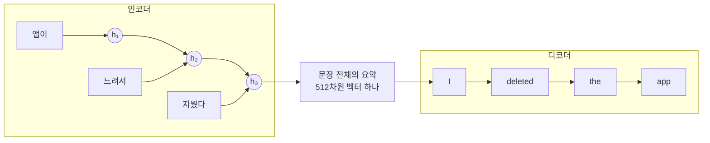
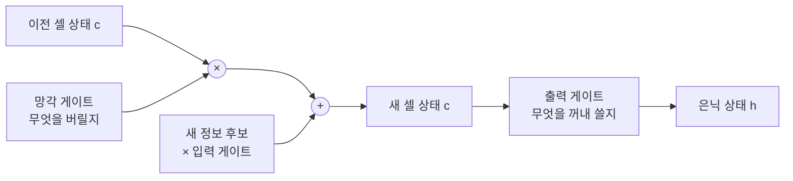
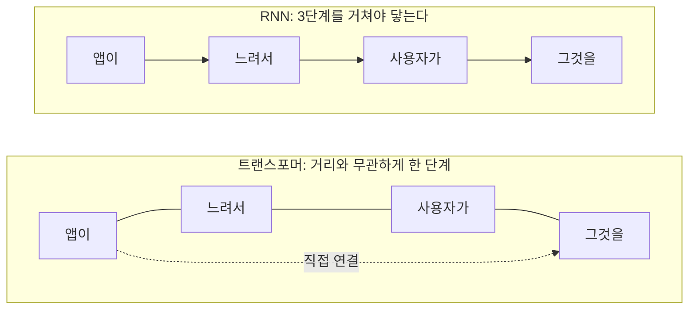

트랜스포머 논문("Attention Is All You Need")의 1장은 "이것들의 한계 때문에 새 구조를 만들었다"고
말한다. 그 "이것들"이 바로 RNN(Recurrent Neural Network, 순환 신경망)과
LSTM(Long Short-Term Memory, 장단기 기억), 트랜스포머 이전 세대의 순차 처리 구조다.
이 글은 왜 이런 구조가 필요했고, 어떤 문제에 부딪혔으며, 트랜스포머가 그 문제를 어떻게
넘어섰는지를 정리한 것이다.

## 왜 특별한 구조가 필요했나

일반 신경망은 **입력 크기가 고정**이다. 행렬 크기가 정해져 있으니 당연하다.
그런데 문장은 길이가 제각각이다.

```text
"좋아"                              → 1단어
"앱이 느려서 사용자가 그것을 지웠다"  → 5단어
```

**가변 길이를 어떻게 처리할 것인가** — RNN이 풀려던 문제가 이것이다.

## RNN의 답: 하나씩 접어 넣는다

```python
h = 초기상태          # 512차원 벡터, 처음엔 전부 0
for 단어 in 문장:
    h = f(h, 단어)    # 요약을 갱신
```

`h`가 **은닉 상태(hidden state)**, 즉 지금까지 읽은 내용의 요약이다.

중요한 성질이 둘 있다.

1. `h`의 크기는 **항상 512로 고정**이다. 1단어를 읽든 100단어를 읽든 똑같다.
   → 가변 길이 문제 해결
2. `f`는 **매 단계 동일한 함수**다. 같은 가중치를 계속 재사용한다.
   → 문장이 길어져도 파라미터 수가 늘지 않음

### f 안에서 일어나는 일

$$
h_t = \tanh(W_h h_{t-1} + W_x x_t + b)
$$

- $$h_{t-1}$$: 이전까지의 요약 (512차원)
- $$x_t$$: 이번 단어의 임베딩 (512차원)
- $$W_h$$, $$W_x$$: 학습되는 가중치
- $$\tanh$$: 활성화 함수. 출력을 $$-1 \sim 1$$로 눌러줌

앞선 글에서 본 신경망 층 그대로다. 입력이 두 개일 뿐 새로운 게 없다.
논문 1장의 표현으로는, 은닉 상태 $$h_t$$를 이전 은닉 상태 $$h_{t-1}$$과 위치 $$t$$의 입력의
함수로 생성한다.

```kotlin
// fold와 구조가 같다
val finalState = words.fold(initialState) { h, word ->
    transform(h, word)   // 같은 함수를 반복 적용
}
```

### 직관: 요약하며 읽어나간다

RNN을 한 줄로 말하면 **읽으면서 계속 요약을 갱신하는 기계**다.
사람이 긴 문단을 읽을 때를 떠올려 보면 된다. 우리는 모든 문장을 통째로 외우지 않는다.
한 문장을 읽으면 "지금까지 무슨 얘기였는지"를 머릿속에서 조금씩 고쳐 쓴다.
그 "머릿속 요약"이 은닉 상태 `h`이고, 한 단어를 읽고 요약을 고쳐 쓰는 행위가 `f`다.

`"앱이 느려서 지웠다"`를 읽는다고 하자.

| 읽은 단어 | 요약 갱신 | 머릿속 요약 |
|---|---|---|
| — | $$h_0 = [0, 0, \dots]$$ | 시작. 아무것도 안 읽음 |
| "앱이" | $$h_1 = f(h_0, x_1)$$ | "앱에 대한 이야기구나" |
| "느려서" | $$h_2 = f(h_1, x_2)$$ | "앱이 느리다는 이야기" |
| "지웠다" | $$h_3 = f(h_2, x_3)$$ | "느려서 앱을 지웠다" |

$$h_3$$ 하나만 넘겨받으면 문장 전체를 다시 읽지 않아도 무슨 뜻이었는지 알 수 있다.
이게 요약의 힘이다. 그리고 이 요약은 **자기 자신을 입력으로 다시 받는다**.
$$h_2$$를 만들 때 $$h_1$$을 쓰고, $$h_3$$를 만들 때 $$h_2$$를 쓴다.
출력이 다음 입력으로 되먹는(recurrent) 이 구조 때문에 **순환 신경망(Recurrent Neural Network)**이라 부른다.

주의할 점은, 이 요약이 사람이 쓰는 문장 요약이 아니라 **512개짜리 숫자 배열**이라는 것이다.
무엇을 기억하고 무엇을 버릴지는 아무도 정해주지 않는다.
`f`의 가중치 `W_h`, `W_x`가 수많은 문장으로 학습되면서, 요약에 무엇을 남길지가 저절로 정해진다.

## 번역기에서의 사용



**병목이 보인다.** 원문 전체가 $$h_3$$라는 512차원 벡터 하나에 담겨야 한다.
문장이 길어지면 담을 수 없다.

이 병목을 완화하려고 나온 게 **원래의 어텐션**이다.
디코더가 $$h_3$$ 하나만 보는 대신 $$h_1, h_2, h_3$$를 전부 보되 필요한 것에 가중치를 주게 한 것이다.

> **어텐션은 RNN의 보조 장치로 태어났다.**
> 트랜스포머는 "보조를 주인공으로 올리고 RNN을 버리자"였다.
> 논문 제목 "Attention Is All You Need"의 의미가 이것이다.

논문 1장도 같은 말을 한다. 어텐션 메커니즘은 이미 널리 쓰였지만 거의 항상 순환 신경망과
**함께** 쓰였다고.

## 문제 1: 병렬화 불가

```python
h1 = f(h0, "앱이")      # 먼저
h2 = f(h1, "느려서")    # h1이 있어야 가능
h3 = f(h2, "지웠다")    # h2가 있어야 가능
```

건너뛸 방법이 없다. **순전파만 그런 게 아니라 역전파도** 거꾸로 하나씩 내려와야 한다.
100단어면 앞으로 100번, 뒤로 100번이다.
GPU는 수천 개 연산을 동시에 돌리는 장치인데, 이 구조에서는 한 번에 하나씩밖에 못 한다.

논문 1장의 표현으로는, 이 본질적으로 순차적인 성질이 훈련 샘플 내부의 병렬화를 원천 차단하며
시퀀스가 길어질수록 치명적이 된다. 메모리 제약 때문에 배치로 묶는 것에도 한계가 있다.

## 문제 2: 기울기 소실

50단어 문장에서 첫 단어의 가중치를 갱신하려면 손실 신호가 50단계를 거슬러 올라와야 한다.
그리고 **같은 `W_h`가 50번 곱해진다.**

| 곱해지는 스케일 | 50단계 뒤 | |
|---|---|---|
| 0.9 | $$0.9^{50} \approx 0.005$$ | 0.5%만 도달 |
| 0.8 | $$0.8^{50} \approx 10^{-5}$$ | 사실상 0 |
| 1.1 | $$1.1^{50} \approx 117$$ | 기울기 폭발, 발산 |

곱셈이 반복되니 0으로 수렴하거나 무한대로 발산하거나 둘 중 하나가 되기 쉽다.
**모델이 긴 의존 관계를 배울 수 없다.** 이 문제는 Hochreiter 등이 일찍이 다룬 바 있다.

## LSTM: 두 번째 문제에 대한 답

LSTM(Long Short-Term Memory, 장단기 기억)은 1997년에 나온 구조다.
이름 그대로 **짧게 흘려보내는 기억과 오래 붙드는 기억을 나눠서** 다루려는 시도다.

### 왜 곱셈이 문제였나

기울기 소실의 뿌리는 앞에서 봤듯 요약을 갱신할 때마다 같은 `W_h`가 곱해진다는 데 있다.
곱셈은 반복되면 값을 0으로 끌어내리거나 무한대로 튕겨낸다. 신호가 멀리 못 간다.
그렇다면 **정보를 나르는 주 통로에서 곱셈을 빼면 되지 않을까**가 LSTM의 착상이다.

### 셀 상태: 곱셈 없이 흐르는 컨베이어 벨트

`h`와 별도로 **셀 상태(cell state)** `c`라는 통로를 하나 더 둔다.
`h`가 매 단계 요약을 새로 쓰는 통로라면, `c`는 정보를 **덧셈으로 얹고 덜어내며** 길게 실어 나르는
컨베이어 벨트에 가깝다.

RNN은 요약을 갱신할 때마다 가중치가 곱해진다.

$$
h_t = \tanh(W_h h_{t-1} + W_x x_t + b)
$$

LSTM의 벨트는 덧셈이 주된 경로다. $$f_t$$가 망각 게이트, $$i_t$$가 입력 게이트,
$$\tilde{c}_t$$가 이번 단어에서 뽑아낸 새 정보 후보이고, $$\odot$$은 원소별 곱이다.

$$
c_t = f_t \odot c_{t-1} + i_t \odot \tilde{c}_t
$$

벨트를 따라 정보가 흐를 때 곱셈 대신 덧셈이 주된 경로이므로, 신호가 여러 단계를 지나도
급격히 죽거나 폭발하지 않는다. 그래서 먼 과거의 정보도 살아남을 수 있다.

어디서 본 구조다. 앞선 글의 잔차 연결 $$x + \mathrm{Sublayer}(x)$$와 같은 원리다.
"정보가 곱셈에 시달리지 않고 통과할 지름길을 하나 열어둔다"는 발상이 똑같다.
서로 다른 맥락, 20년의 간격을 두고 나온 해법인데 뿌리가 같다.

### 게이트: 무엇을 버리고 담고 내보낼지

벨트에 아무거나 계속 쌓이면 그것대로 곤란하다. 그래서 LSTM은 **게이트(gate)** 세 개로
벨트를 여닫는다. 각 게이트는 0~1 사이 값을 내놓는 작은 신경망이고, 전부 학습된다.
0이면 완전히 닫고(통과 0%), 1이면 완전히 연다(통과 100%)고 보면 된다.

| 게이트 | 하는 일 |
|---|---|
| 망각 게이트 | 벨트에 실린 기존 기억 중 뭘 버릴지 (0이면 삭제, 1이면 유지) |
| 입력 게이트 | 이번 단어의 새 정보 중 뭘 벨트에 실을지 |
| 출력 게이트 | 벨트에 실린 기억 중 뭘 지금 꺼내 쓸지 |



벨트(`c`)를 지나는 주 경로에 곱셈이 한 번(망각 게이트)뿐이고 나머지는 덧셈이라는 점,
그리고 은닉 상태 `h`가 벨트에서 갈라져 나온다는 점이 그림에서 보인다.

예를 들어 `"그 앱은 …(여러 단어)… 그것을 지웠다"`에서 "그 앱"이라는 주어를
"그것"이 나올 때까지 붙들어야 한다면, 그 사이 단어들에서는 망각 게이트를 열어(≈1) 주어를
유지하고 입력 게이트는 닫아 잡음을 안 싣는 식이다.
덕분에 "이 정보는 중요하니 30단어 뒤까지 들고 간다"가 가능해진다.
이 여닫음을 **사람이 규칙으로 정하는 게 아니라 학습으로 얻는다**는 점이 핵심이다.

**GRU**(Gated Recurrent Unit)는 이 아이디어를 유지하되 게이트를 두 개로 줄이고
셀 상태와 은닉 상태를 하나로 합친 단순화 버전이다. 파라미터가 적어 더 가볍다.

## 그래도 안 풀린 것

논문 1장은 이런 효율성 개선 시도들이 있었지만
**순차 계산이라는 근본적 제약은 여전히 남아 있다**고 말한다.

| | RNN | LSTM | 트랜스포머 |
|---|---|---|---|
| 가변 길이 | 해결 | 해결 | 해결 |
| 기울기 소실 | 심각 | 완화 | 해결 |
| **병렬화** | **불가** | **불가** | **가능** |

LSTM은 기억 문제를 **완화**했을 뿐이다. 50단어는 되지만 500단어는 여전히 어렵다.
병렬화는 손도 대지 못했다. 여전히 for 루프다.

## 트랜스포머의 발상

두 문제의 뿌리가 같다. **정보를 한 단계씩 순차적으로 전달한다는 것.**



### 논문 4장 Table 1

| 층 유형 | 층당 복잡도 | 순차 연산 | 최대 경로 길이 |
|---|---|---|---|
| 셀프 어텐션 | $$O(n^2 \cdot d)$$ | $$\mathbf{O(1)}$$ | $$\mathbf{O(1)}$$ |
| 순환(RNN/LSTM) | $$O(n \cdot d^2)$$ | $$O(n)$$ | $$O(n)$$ |
| 합성곱 | $$O(k \cdot n \cdot d^2)$$ | $$O(1)$$ | $$O(\log_k n)$$ |

- **순차 연산 $$O(1)$$** → 병렬화 가능. 문제 1 해결
- **최대 경로 길이 $$O(1)$$** → 신호가 한 단계만 거침. 문제 2 해결

논문은 경로가 짧을수록 장거리 의존 관계를 배우기 쉽다고 말한다.
RNN에서 50단어 떨어진 두 단어는 50단계지만, 트랜스포머에서는 1단계다.

**대신 치른 대가**가 층당 복잡도 $$O(n^2 \cdot d)$$다.
저자들은 문장 길이 $$n$$이 표현 차원 $$d$$보다 작으면 오히려 셀프 어텐션이 더 빠르고,
당시 번역 모델에서는 대개 그랬다고 논증한다.

> $$n=50$$, $$d=512$$면 셀프 어텐션이 유리하다.
> 하지만 $$n$$이 10만 토큰이 되면 이야기가 달라진다.
> **지금 긴 컨텍스트가 비싼 근본 원인이 이 표에 이미 적혀 있었다.**

## 요약

| 개념 | 한 줄 |
|---|---|
| RNN | 은닉 상태를 들고 단어를 하나씩 접어나가는 구조 |
| 은닉 상태 | 지금까지 읽은 내용의 고정 크기 요약 |
| 문제 1 | 순차적이라 병렬화 불가 |
| 문제 2 | 같은 가중치가 반복 곱해져 기울기 소실 |
| LSTM | 게이트와 덧셈 경로로 기억 문제 완화. 병렬화는 여전히 불가 |
| 어텐션의 출발 | 원래는 RNN의 병목을 돕는 보조 장치 |
| 트랜스포머 | 순차 전달을 버리고 직접 연결로. 두 문제 동시 해결 |

## 참고

- [Attention Is All You Need (Vaswani et al., 2017)](https://arxiv.org/abs/1706.03762) — 본문에서 언급한 트랜스포머 논문. 1장이 RNN/LSTM의 한계를, 4장 Table 1이 복잡도 비교를 다룬다
- [Long Short-Term Memory (Hochreiter & Schmidhuber, 1997)](https://www.bioinf.jku.at/publications/older/2604.pdf) — LSTM 원본 논문
- [Learning Phrase Representations using RNN Encoder-Decoder (Cho et al., 2014)](https://arxiv.org/abs/1406.1078) — GRU가 제안된 논문
- [Neural Machine Translation by Jointly Learning to Align and Translate (Bahdanau et al., 2014)](https://arxiv.org/abs/1409.0473) — RNN 번역기의 병목을 완화하려 나온 "원래의 어텐션"
