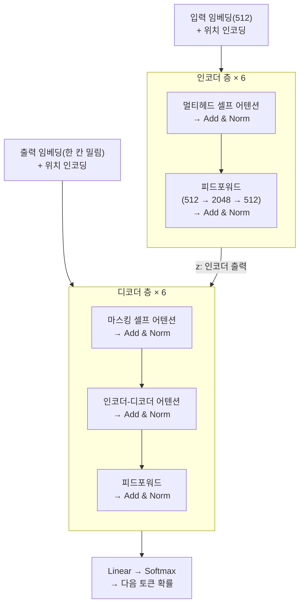

앞선 글에서 트랜스포머가 순차 전달을 버리고 직접 연결로 갔다는 것까지 봤다.
이 글은 그 다음, 실제로 그 구조가 어떻게 생겼는지를 논문("Attention Is All You Need") 3장을
따라가며 정리한 것이다. 결론부터 말하면 부품은 놀랄 만큼 단순하고, 어려운 건
그 부품들을 잇는 배관 쪽이다.

## 이름의 유래

깊은 뜻은 없다. 공저자 Jakob Uszkoreit이 **단어 어감이 좋아서** 골랐다.
초기 내부 설계 문서 제목이 「Transformers: Iterative Self-Attention and Processing for
Various Tasks」였고, 영화 트랜스포머 이미지가 삽입돼 있었으며 팀은 스스로를
"Team Transformer"라 불렀다. 논문 제목도 비틀즈 "All You Need Is Love"의 말장난이다.

그래도 이름이 구조를 잘 설명하긴 한다. 실제로 하는 일이
**벡터를 층마다 계속 변환(transform)하는 것**이기 때문이다.
논문이 기존 모델을 "sequence transduction models"라 부르는 것과도 이어진다.

## 전체 구조



## 인코더-디코더라는 판

- **인코더**: 입력 $$(x_1, \dots, x_n)$$을 연속적 표현 $$z = (z_1, \dots, z_n)$$으로 바꾼다
- **디코더**: $$z$$를 받아 출력 $$(y_1, \dots, y_m)$$을 **한 번에 하나씩** 생성한다

핵심 단어는 **auto-regressive(자기회귀)**다.
각 단계에서 이전에 생성한 심볼을 추가 입력으로 소비한다.

트랜스포머는 이 판을 그대로 유지하고 **내용물만 바꿨다**.
순환 층을 걷어내고 스택된 셀프 어텐션 + 위치별 완전연결 층으로 채웠다.

## 인코더/디코더 스택 (3.1)

### 인코더: 동일한 층 6개

$$N = 6$$개의 동일한 층을 쌓고, 각 층은 하위 층 두 개로 이뤄진다.

1. 멀티헤드 셀프 어텐션
2. 위치별 완전연결 피드포워드 네트워크

### 배관: $$\mathrm{LayerNorm}(x + \mathrm{Sublayer}(x))$$

**잔차 연결** — 하위 층 출력에 입력을 그대로 더한다.

| | 하위 층의 출력 |
|---|---|
| 일반 | $$y = \mathrm{Sublayer}(x)$$ |
| 잔차 적용 | $$y = x + \mathrm{Sublayer}(x)$$ |

역전파 시 이 경로로는 **곱셈 없이 신호가 그대로 전달**된다. 고속도로가 뚫린 것이다.
없으면 층을 깊게 쌓을 수 없다. 논문이 참고문헌 [10]으로 ResNet을 다는 이유다.

```kotlin
// 잔차 없음: 매 단계가 완전히 새 객체를 만듦
state = transform(state)

// 잔차: 원본을 유지하고 변화분만 얹음
state = state.copy(delta = transform(state))
```

각 층이 "완전히 새 표현을 만들어라"가 아니라
**"기존 표현에 무엇을 더할지만 정해라"**가 된다.

**여기서 제약 하나가 나온다.** 덧셈을 하려면 차원이 같아야 한다. 그래서 논문은
**모든 하위 층과 임베딩 층의 출력 차원을 $$d_{\mathrm{model}} = 512$$로 통일**했다.
아키텍처 전체가 하나의 숫자로 묶인 이유가 이 덧셈 하나 때문이다.

**층 정규화**는 반대쪽을 막는다. 더하기를 반복하면 값이 폭주하므로, 각 토큰의 512개 숫자를
평균 0, 분산 1로 맞춘다. **각 토큰마다 독립적으로** 하기 때문에 문장 길이가 제각각이어도
문제가 없다.

> 잔차 연결 = 신호가 사라지지 않게  
> 층 정규화 = 신호가 폭주하지 않게

### 디코더: 하위 층 세 개

1. **마스킹된** 멀티헤드 셀프 어텐션
2. **인코더 출력에 대한 멀티헤드 어텐션** ← 추가분
3. 피드포워드

2번이 번역기의 핵심이다. 논문 Figure 1에서 왼쪽 인코더에서 오른쪽 디코더로 건너가는
화살표가 이것이다.

**마스킹**: 디코더 셀프 어텐션은 뒤쪽 위치를 참조하지 못한다.
이 마스킹과 출력 임베딩을 한 칸 민 것이 합쳐져, 위치 $$i$$의 예측은 $$i$$보다 앞선
위치에만 의존하게 된다.

## 같은 부품, 세 가지 역할 (3.2.3)

Q/K/V를 **어디서 가져오느냐**로 역할이 완전히 달라진다.

| 위치 | Query 출처 | Key/Value 출처 | 하는 일 |
|---|---|---|---|
| 인코더 셀프 어텐션 | 이전 인코더 층 | 이전 인코더 층 | 입력 문장 내부 문맥 파악 |
| 디코더 셀프 어텐션 | 이전 디코더 층 | 이전 디코더 층 | 생성 중인 문장 내부 문맥 (마스킹) |
| 인코더-디코더 어텐션 | 이전 디코더 층 | **인코더 출력** | 생성하며 원문 참조 |

### 번역 예시로 풀면

`앱이 느려서 지웠다` → `I deleted the app`

**① 인코더 셀프 어텐션 — 원문 이해**

```text
[앱이] [느려서] [지웠다]     ← 셋이 서로를 자유롭게 참조
```

6층을 통과하면 각 토큰이 문맥을 흡수한 벡터가 된다. 이 결과가 $$z$$다.

**② 디코더 셀프 어텐션 — 지금까지 쓴 것 돌아보기**

```text
[I] [deleted] [the] [?]
```

`deleted`라는 타동사를 썼으니 목적어가 와야 한다는 걸 안다.
여기가 마스킹이 걸리는 곳이다. 훈련 중엔 정답 문장 전체가 입력으로 들어가므로
물리적으로 뒤가 보인다. 그래서 강제로 가려야 한다.

**③ 인코더-디코더 어텐션 — 원문 참조**

```text
Query:  "삭제된 대상이 뭐지?"        ← 디코더에서
Key/V:  [앱이] [느려서] [지웠다]     ← 인코더 출력 z에서
```

논문이 이걸 "메모리 키와 값"이라 부르는 게 적절하다.
인코더 출력은 디코더 입장에서 **읽기 전용 참조 자료**다.

> Q와 K/V가 **같은 곳**에서 오면 셀프 어텐션,
> **다른 곳**에서 오면 크로스 어텐션. 부품은 하나고 배선만 다르다.

## 피드포워드 층 (3.3)

$$
\mathrm{FFN}(x) = \max(0,\; xW_1 + b_1)W_2 + b_2
$$

ReLU를 사이에 낀 선형 변환 두 개. 그게 전부다.

**"위치별(position-wise)"이 핵심이다.** 각 위치에 따로, 그리고 동일하게 적용된다.
토큰끼리 정보를 섞지 않는다.

> 어텐션 = 토큰 **간** 정보를 섞는 층  
> 피드포워드 = 각 토큰이 **혼자서** 자기 벡터를 가공하는 층
>
> 이 둘의 교대가 트랜스포머다.

**놓치기 쉬운 숫자**가 하나 있다. 입출력은 512인데 **내부 차원은 2048**이다.
4배로 부풀렸다가 줄인다. 모델 파라미터의 상당 부분이 사실 이 층에 있다.
어텐션이 유명하지만 무게중심은 여기다.

## 위치 인코딩 (3.5)

순환도 합성곱도 없으니 순서 정보가 통째로 없다.
`사용자가 앱을 지웠다`와 `앱이 사용자를 지웠다`를 구분하지 못한다.

**방식**은 주기가 다른 사인/코사인 함수다. 파장이 $$2\pi$$부터 $$10000 \cdot 2\pi$$까지
등비수열을 이룬다.

$$
\mathrm{PE}_{(pos,\, 2i)} = \sin\!\left(\frac{pos}{10000^{2i/d_{\mathrm{model}}}}\right)
\qquad
\mathrm{PE}_{(pos,\, 2i+1)} = \cos\!\left(\frac{pos}{10000^{2i/d_{\mathrm{model}}}}\right)
$$

**왜 삼각함수인가.** 논문의 가설은 이렇다. 임의의 고정 오프셋 $$k$$에 대해
$$\mathrm{PE}_{pos+k}$$가 $$\mathrm{PE}_{pos}$$의 **선형 함수로 표현될 수 있어서**,
상대적 위치로 참조하는 걸 모델이 쉽게 학습하리라 봤다. "세 칸 뒤"라는 관계가
일정한 변환으로 표현된다는 뜻이다.

**그런데 실험 결과는** 학습된 위치 임베딩으로 바꿔도 성능이 거의 같았다
(Table 3의 E행, BLEU 25.7 대 25.8). 그럼에도 사인 버전을 택한 이유는
**훈련 때보다 긴 시퀀스로 외삽할 수 있을지도 모른다**는 기대 때문이었다.

정교한 수학적 근거로 보이지만 실은 성능 차이가 없었고, 선택 근거도
"may allow"라는 추측이었다.

## GPT·클로드는 디코더만 쓴다

과제가 "이어서 쓰기" 하나뿐이므로 참조할 별도 원문이 없다.
위 표에서 **가운데 줄만** 남는다.

시스템 프롬프트, 사용자 메시지, 이전 대화가 전부
**하나의 이어지는 토큰 시퀀스**에 나란히 놓인다.

> **"컨텍스트 윈도우가 유일한 상태"의 구조적 근거가 이것이다.**
> 인코더가 없으니 별도로 정보를 담아둘 곳이 없고,
> 모든 게 그 한 줄의 시퀀스 안에 들어가야 한다.

## 기억할 세 가지

1. 구조 자체는 단순한 블록의 반복이다.
   복잡한 건 부품이 아니라 배관(잔차 연결, 정규화, 차원 통일)이다.
2. 같은 어텐션 부품이 Q/K/V 출처만 바꿔 세 가지 역할을 한다.
3. 어텐션은 토큰 간 정보를 섞고, 피드포워드는 각 토큰이 혼자 가공한다.

## 주요 하이퍼파라미터 (기본 모델)

| 항목 | 값 |
|---|---|
| 층 수 $$N$$ | 6 (인코더, 디코더 각각) |
| $$d_{\mathrm{model}}$$ | 512 |
| 피드포워드 내부 차원 $$d_{ff}$$ | 2048 |
| 헤드 수 $$h$$ | 8 |
| $$d_k = d_v$$ | 64 |
| 드롭아웃 | 0.1 |
| 파라미터 수 | 6500만 |

## 참고

- [Attention Is All You Need (Vaswani et al., 2017)](https://arxiv.org/abs/1706.03762) — 이 글이 따라간 논문. 3장이 모델 구조를, Table 3이 위치 인코딩 비교 실험을 담고 있다
- [Deep Residual Learning for Image Recognition (He et al., 2015)](https://arxiv.org/abs/1512.03385) — 잔차 연결의 원본. 논문 참고문헌 [10]
- [Layer Normalization (Ba et al., 2016)](https://arxiv.org/abs/1607.06450) — 층 정규화 원본 논문
- [Eight Google Employees Invented Modern AI (WIRED, 2024)](https://www.wired.com/story/eight-google-employees-invented-modern-ai-transformers-paper/) — "Transformer"라는 이름이 어떻게 정해졌는지에 대한 저자들의 회고
