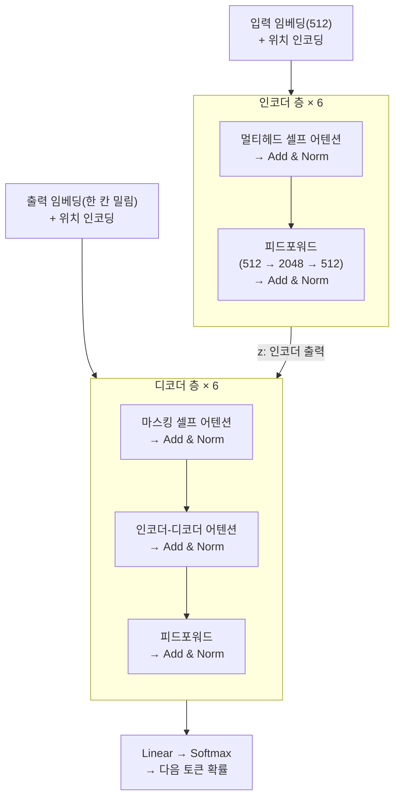
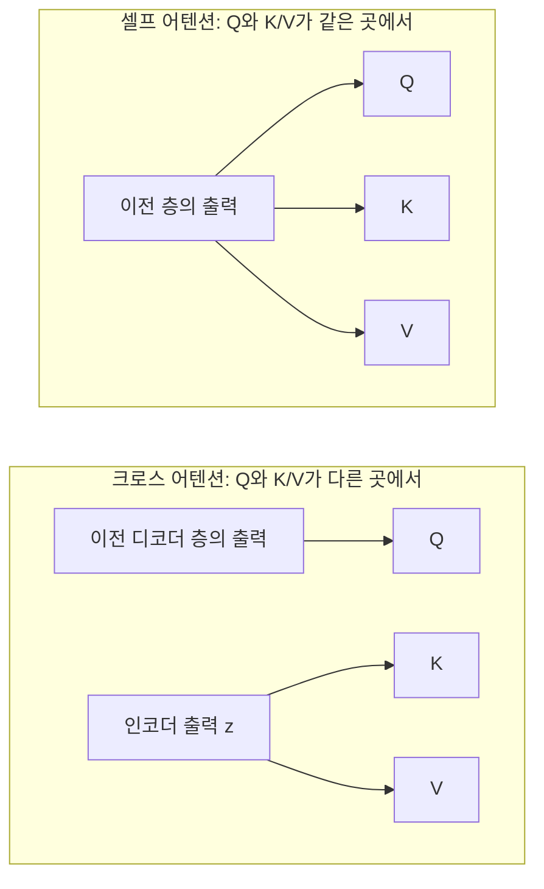

앞선 글에서 트랜스포머가 순차 전달을 버리고 직접 연결로 갔다는 것까지 봤다.
이 글은 그 다음, 실제로 그 구조가 어떻게 생겼는지를 논문("Attention Is All You Need") 3장을
따라가며 정리한 것이다. 결론부터 말하면 부품은 놀랄 만큼 단순하고, 어려운 건
그 부품들을 잇는 배관 쪽이다.

## 이름의 유래

깊은 뜻은 없다. 공저자 Jakob Uszkoreit이 **단어 어감이 좋아서** 골랐다.
초기 내부 설계 문서 제목이 「Transformers: Iterative Self-Attention and Processing for
Various Tasks」였고, 영화 트랜스포머 이미지가 삽입돼 있었으며 팀은 스스로를
"Team Transformer"라 불렀다. 논문 제목도 비틀즈 "All You Need Is Love"의 말장난이다.

그래도 이름이 구조를 잘 설명하긴 한다. 실제로 하는 일이
**벡터를 층마다 계속 변환(transform)하는 것**이기 때문이다.
앞선 글에서 봤듯 단어는 임베딩을 거쳐 512개 숫자의 벡터가 된다. 트랜스포머가 하는 일은
그 벡터를 층마다 조금씩 고쳐 쓰는 것이고, 다 고치고 나면 그 벡터에서 다음 단어를 뽑아낸다.
논문이 기존 모델을 "sequence transduction models"라 부르는 것과도 이어진다.

## 먼저: 어텐션이 하는 일

3장을 읽으려면 어텐션이 무엇인지가 먼저 깔려 있어야 한다. 구조 이야기의 절반이
"어떤 어텐션을 어디에 놓았는가"이기 때문이다. 이 글의 주제는 아니니 필요한 만큼만 짚고 간다.

한 문장으로 말하면, 어텐션은
**각 단어가 다른 단어들에게 질문을 던지고 답을 받아 자기 벡터를 갱신하는 것**이다.

`앱이 느려서 지웠다`에서 `지웠다`라는 단어를 생각해 보자. `지웠다` 혼자만 보면
무엇을 지웠는지 알 수 없다. 그래서 `지웠다`는 문장의 다른 단어들을 둘러보고
`앱이`에서 정보를 많이 가져와 자기 벡터에 섞는다. 이게 어텐션이다.

### Q, K, V

이 "질문하고 답받기"를 세 개의 벡터로 나눠 구현한다.

| 이름 | 역할 | 비유 |
|---|---|---|
| Query (Q) | 내가 찾는 것 | 검색창에 친 검색어 |
| Key (K) | 내가 가진 것의 이름표 | 책등에 붙은 제목 |
| Value (V) | 실제로 건네줄 내용 | 책의 본문 |

도서관에 비유하면 이렇다. 질문(Q)을 들고 가서 책등의 제목(K)들과 대조해 얼마나 맞는지
점수를 매기고, 그 점수를 가중치 삼아 책 내용(V)들을 섞어서 가져온다.
한 권만 고르는 게 아니라 **전부 조금씩 섞어 온다**는 게 핵심이다. 점수가 높은 책은 많이,
낮은 책은 거의 안 섞인다.

$$
\mathrm{Attention}(Q, K, V) = \mathrm{softmax}\!\left(\frac{QK^\top}{\sqrt{d_k}}\right)V
$$

$$QK^\top$$이 "질문과 이름표를 대조해 점수 매기기", softmax가 "그 점수를 합이 1인
비율로 바꾸기", 마지막 $$V$$를 곱하는 게 "그 비율대로 내용을 섞기"다.

**여기서 꼭 붙잡고 가야 할 사실이 하나 있다.** Q, K, V는 하늘에서 떨어지지 않는다.
입력으로 들어온 토큰 벡터에 학습되는 행렬 $$W^Q$$, $$W^K$$, $$W^V$$를 각각 곱해서 만든다.

$$
Q = X W^Q \qquad K = X W^K \qquad V = X W^V
$$

그래서 뒤에 나올 **"Q/K/V를 어디서 가져오느냐"**는 말은
**"어느 층의 출력 벡터를 $$X$$ 자리에 넣느냐"**라는 뜻이다. 이 한 가지만 바꾸면
똑같은 부품이 전혀 다른 일을 한다. 3.2.3절이 그 이야기다.

**멀티헤드**는 이 과정을 8번 병렬로 돌리는 것이다. 512차원을 64차원씩 8조각으로 나눠
각 조각이 따로 어텐션을 하고, 결과를 다시 이어 붙인다. 한 번에 한 관점만 보지 말고
여러 관점(문법 관계, 의미 관계 등)을 동시에 보라는 뜻이다.

## 전체 구조



이 그림을 읽는 법은 이렇다. 왼쪽 위에서 원문이 들어가 인코더 6층을 통과하며
"이 문장이 무슨 뜻인지"를 담은 벡터 뭉치 $$z$$가 된다. 오른쪽 아래에서는 지금까지 만든
번역문이 디코더 6층을 통과하는데, 중간에 $$z$$를 참조한다. 마지막에 나온 벡터를
단어 개수만큼의 확률로 바꾸면 다음에 쓸 단어가 정해진다.

"× 6"은 **똑같이 생긴 층을 여섯 번 통과한다**는 뜻이다. 층마다 가중치는 따로 학습되지만
구조는 완전히 같다. 한 번 통과할 때마다 각 단어 벡터가 문맥을 조금씩 더 흡수한다고 보면 된다.

## 인코더-디코더라는 판

- **인코더**: 입력 $$(x_1, \dots, x_n)$$을 연속적 표현 $$z = (z_1, \dots, z_n)$$으로 바꾼다
- **디코더**: $$z$$를 받아 출력 $$(y_1, \dots, y_m)$$을 **한 번에 하나씩** 생성한다

핵심 단어는 **auto-regressive(자기회귀)**다. 논문 표현으로는 "각 단계에서 이전에 생성한
심볼을 추가 입력으로 소비한다". 말이 어려운데, 실제로 벌어지는 일은 단순하다.

```text
1단계: 입력 [시작]                   → 출력 "I"
2단계: 입력 [시작] I                 → 출력 "deleted"
3단계: 입력 [시작] I deleted         → 출력 "the"
4단계: 입력 [시작] I deleted the     → 출력 "app"
5단계: 입력 [시작] I deleted the app → 출력 [끝]
```

방금 만든 단어를 다시 입력 끝에 붙여서 모델을 또 돌린다. 그래서 문장 하나를 만들려면
모델을 단어 수만큼 반복 실행해야 한다. 지금 챗봇이 글자를 한 자씩 뱉는 것도 이 구조 때문이다.

트랜스포머는 이 인코더-디코더라는 판을 그대로 유지하고 **내용물만 바꿨다**.
RNN 시절에도 인코더-디코더 자체는 있었다. 트랜스포머는 그 안의 순환 층을 걷어내고
스택된 셀프 어텐션 + 위치별 완전연결 층으로 채웠다.

## 인코더/디코더 스택 (3.1)

### 인코더: 동일한 층 6개

$$N = 6$$개의 동일한 층을 쌓고, 각 층은 하위 층 두 개로 이뤄진다.

1. 멀티헤드 셀프 어텐션 — 토큰끼리 정보를 주고받는다
2. 위치별 완전연결 피드포워드 네트워크 — 각 토큰이 받은 정보를 혼자 가공한다

### 배관: $$\mathrm{LayerNorm}(x + \mathrm{Sublayer}(x))$$

논문은 각 하위 층을 그냥 통과시키지 않는다. 하위 층을 $$\mathrm{Sublayer}$$라 부르면,
실제로 다음 층에 넘기는 값은 $$\mathrm{LayerNorm}(x + \mathrm{Sublayer}(x))$$다.
여기에 두 가지 장치가 들어 있다.

#### 잔차 연결: 신호가 사라지지 않게

하위 층의 출력에 **입력을 그대로 다시 더한다**.

| | 하위 층의 출력 |
|---|---|
| 일반 | $$y = \mathrm{Sublayer}(x)$$ |
| 잔차 적용 | $$y = x + \mathrm{Sublayer}(x)$$ |

왜 이런 걸 하나. 앞선 역전파 글에서 봤듯, 학습할 때 기울기는 마지막 층에서 시작해
층을 거꾸로 거슬러 오며 **계속 곱해진다**. 층마다 곱해지는 값이 0.9쯤이라 치면
6층은 $$0.9^6 \approx 0.53$$이라 버틸 만하지만, 96층이면
$$0.9^{96} \approx 0.00004$$다. 앞쪽 층에는 신호가 사실상 도착하지 않는다.
RNN에서 봤던 기울기 소실과 똑같은 문제다.

잔차 연결이 있으면 미분이 이렇게 된다.

$$
\frac{\partial}{\partial x}\bigl(x + \mathrm{Sublayer}(x)\bigr) = 1 + \mathrm{Sublayer}'(x)
$$

**항상 1이 남는다.** 하위 층 쪽 기울기가 아무리 작아져도 1이 더해져 있으니 곱셈으로
0이 되지 않는다. 층을 거슬러 가는 고속도로가 하나 뚫린 셈이다. 이게 없으면 애초에
층을 깊게 쌓을 수 없다. 논문이 이 대목에 참고문헌 [10]으로 ResNet을 다는 이유다.

코드로 감각을 잡으면 이런 차이다.

```kotlin
// 잔차 없음: 매 단계가 완전히 새 객체를 만듦
state = transform(state)

// 잔차: 원본을 유지하고 변화분만 얹음
state = state.copy(delta = transform(state))
```

각 층에 주어진 과제가 "완전히 새 표현을 만들어라"가 아니라
**"기존 표현에 무엇을 더할지만 정해라"**가 된다. 훨씬 쉬운 문제다.
극단적으로 아무것도 안 해도 되면 $$\mathrm{Sublayer}(x) = 0$$을 학습하면 그만이라,
층을 늘려도 최소한 손해는 안 본다.

#### 여기서 나오는 제약: 왜 전부 512인가

$$x + \mathrm{Sublayer}(x)$$라는 덧셈을 하려면 두 항의 차원이 같아야 한다.
$$x$$가 512차원이면 하위 층의 출력도 512차원이어야 한다. 그런데 그 출력은
다음 층의 입력이 되고, 거기서도 또 같은 덧셈을 한다.

그래서 논문은 **모든 하위 층과 임베딩 층의 출력 차원을
$$d_{\mathrm{model}} = 512$$로 통일**했다. 임베딩도 512, 어텐션 출력도 512,
피드포워드 출력도 512, 층과 층 사이도 전부 512다.
아키텍처 전체가 하나의 숫자로 묶여 있는데, 그 이유가 이 덧셈 하나다.

#### 층 정규화: 신호가 폭주하지 않게

덧셈을 반복하면 반대 방향 문제가 생긴다. 층을 통과할 때마다 값이 계속 더해지니
숫자가 점점 커진다. 6층, 12층을 지나면 값의 크기가 감당이 안 된다.

그래서 더한 다음 정규화를 한다. 각 토큰이 가진 512개 숫자를 놓고 평균 $$\mu$$와
표준편차 $$\sigma$$를 구해, 평균 0 분산 1로 맞춘다.

$$
\hat{x} = \frac{x - \mu}{\sigma} \qquad y = \gamma \hat{x} + \beta
$$

$$\gamma$$와 $$\beta$$는 학습되는 값으로, "필요하면 다시 늘리고 옮겨도 된다"는
여지를 남겨 둔 것이다.

중요한 건 이 계산을 **각 토큰마다 독립적으로** 한다는 점이다. 다른 토큰이나
같은 배치의 다른 문장을 전혀 참조하지 않는다. 그래서 문장 길이가 제각각이어도,
한 문장씩 처리해도 똑같이 동작한다. 이미지 쪽에서 흔한 배치 정규화는
배치 안의 다른 샘플들을 봐야 해서 이 성질이 없다.

> 잔차 연결 = 신호가 사라지지 않게  
> 층 정규화 = 신호가 폭주하지 않게

### 디코더: 하위 층 세 개

디코더도 6층이고 구조는 비슷한데, 하위 층이 하나 더 있다.

1. **마스킹된** 멀티헤드 셀프 어텐션 — 지금까지 만든 번역문 내부를 본다
2. **인코더 출력에 대한 멀티헤드 어텐션** ← 추가분. 원문을 본다
3. 피드포워드

2번이 번역기의 핵심이다. 이게 없으면 디코더는 원문을 아예 못 보고 그럴듯한 영어 문장만
지어낼 것이다. 논문 Figure 1에서 왼쪽 인코더에서 오른쪽 디코더로 건너가는 화살표가 이것이다.

#### 마스킹은 왜 필요한가

디코더 셀프 어텐션은 자기보다 뒤쪽 위치를 참조하지 못하게 막혀 있다.
언뜻 이상하게 들린다. 어차피 아직 안 만든 단어인데 볼 수가 있나?

**추론(실제 사용) 때는 정말 못 본다.** 아직 생성되지 않았으니 존재하지도 않는다.
문제는 **훈련 때**다. 훈련 때 이렇게 한 단어씩 돌리면 너무 느리다. 그래서 정답 문장
`I deleted the app`을 통째로 입력에 넣고 모든 위치의 예측을 한 번에 계산한다.
병렬 처리를 위해서다. 그런데 그러면:

| 자리 | 1 | 2 | 3 | 4 | 5 |
|---|---|---|---|---|---|
| 입력 | `[시작]` | `I` | `deleted` | `the` | `app` |
| 맞혀야 할 정답 | `I` | `deleted` | `the` | `app` | `[끝]` |

2번 자리를 보자. 여기서는 `deleted`를 맞혀야 한다. 그런데 입력 줄에는
3번 자리의 `deleted`가 이미 들어 있다. 오른쪽 칸을 한 칸 베껴 오기만 하면 100점이다.
커닝이다. 이러면 아무것도 못 배운다.

그래서 어텐션 점수를 계산한 뒤, 자기보다 뒤쪽 위치에 해당하는 칸을 $$-\infty$$로
덮어쓴다. softmax를 통과하면 그 칸의 가중치가 0이 되어 그쪽 정보는 전혀 섞이지 않는다.
"마스킹(가리기)"이라는 이름 그대로다.

이 마스킹과, 출력 임베딩을 한 칸 밀어 넣은 것(그림의 "한 칸 밀림")이 합쳐져서
위치 $$i$$의 예측은 $$i$$보다 앞선 위치에만 의존하게 된다.
훈련 때의 조건과 추론 때의 조건이 같아지는 것이다.

## 같은 부품, 세 가지 역할 (3.2.3)

이제 앞에서 깔아 둔 사실이 쓰인다. Q/K/V는 어떤 벡터에 $$W^Q, W^K, W^V$$를 곱해
만드는데, **그 "어떤 벡터"를 어디서 가져오느냐**에 따라 같은 부품이 세 가지 다른 일을 한다.

| 위치 | Query 출처 | Key/Value 출처 | 하는 일 |
|---|---|---|---|
| 인코더 셀프 어텐션 | 이전 인코더 층 | 이전 인코더 층 | 입력 문장 내부 문맥 파악 |
| 디코더 셀프 어텐션 | 이전 디코더 층 | 이전 디코더 층 | 생성 중인 문장 내부 문맥 (마스킹) |
| 인코더-디코더 어텐션 | 이전 디코더 층 | **인코더 출력** | 생성하며 원문 참조 |



### 번역 예시로 풀면

`앱이 느려서 지웠다` → `I deleted the app`을 만드는 중이라고 하자.

**① 인코더 셀프 어텐션 — 원문 이해**

```text
[앱이] [느려서] [지웠다]     ← 셋이 서로를 자유롭게 참조
```

세 토큰이 서로를 다 볼 수 있다. `지웠다`는 `앱이`를 참조해 "삭제 대상이 앱"이라는 걸
자기 벡터에 담고, `느려서`는 `앱이`를 참조해 "느린 주체가 앱"이라는 걸 담는다.
6층을 통과하면 각 토큰이 문맥을 흡수한 벡터가 된다. 이 결과가 $$z$$다.

여기엔 마스킹이 없다. 원문은 이미 다 주어져 있으니 뒤를 봐도 커닝이 아니다.

**② 디코더 셀프 어텐션 — 지금까지 쓴 것 돌아보기**

```text
[I] [deleted] [the] [?]
```

지금 네 번째 단어를 만들려는 참이다. 이 어텐션은 앞의 `I`, `deleted`, `the`만 본다.
`deleted`라는 타동사를 썼고 `the`까지 붙였으니 이 자리에는 명사가 와야 한다는 걸
여기서 파악한다. **어떤** 명사인지는 아직 모른다. 원문을 안 봤으니까.

**③ 인코더-디코더 어텐션 — 원문 참조**

```text
Query:  "삭제된 대상이 뭐지?"        ← 디코더에서 (②의 결과)
Key/V:  [앱이] [느려서] [지웠다]     ← 인코더 출력 z에서
```

②에서 만든 "명사가 필요하다, 그것도 삭제된 대상"이라는 질문(Q)을 들고 원문 쪽
이름표(K)들과 대조한다. `앱이`의 점수가 높게 나오고, 그 자리의 내용(V)이 많이 섞여
들어온다. 그래서 `app`이 나온다.

논문이 인코더 출력을 "메모리 키와 값"이라 부르는 게 적절하다.
디코더 입장에서 인코더 출력은 **읽기 전용 참조 자료**다. 디코더가 뭘 쓰든
$$z$$는 바뀌지 않는다. 한 번 계산해 두고 매 단계 다시 갖다 쓴다.

> Q와 K/V가 **같은 곳**에서 오면 셀프 어텐션,
> **다른 곳**에서 오면 크로스 어텐션. 부품은 하나고 배선만 다르다.

## 피드포워드 층 (3.3)

$$
\mathrm{FFN}(x) = \max(0,\; xW_1 + b_1)W_2 + b_2
$$

$$\max(0, \cdot)$$가 ReLU다. 그러니 이건 **ReLU를 사이에 낀 선형 변환 두 개**,
앞선 신경망 글에서 본 2층짜리 신경망 그대로다. 새로운 게 없다.

### "위치별(position-wise)"이 핵심

이 층은 각 위치에 **따로**, 그리고 **동일하게** 적용된다.

- **따로**: 1번 토큰의 512차원 벡터를 넣어 결과를 얻고, 2번 토큰도 따로 넣어 결과를 얻는다.
  토큰끼리 정보를 섞지 않는다.
- **동일하게**: 모든 위치가 똑같은 $$W_1, W_2$$를 쓴다. 위치마다 다른 가중치가 아니다.

그럼 이 층은 무슨 일을 하나. 어텐션은 **다른 토큰에서 정보를 가져오는** 일만 한다.
가져온 정보를 실제로 해석하고 변형하는 건 이 층의 몫이다.
`지웠다`가 어텐션으로 `앱이`의 정보를 받아 왔다면, 그 둘을 조합해
"앱-삭제"라는 하나의 의미로 빚어내는 건 여기서 일어난다.

> 어텐션 = 토큰 **간** 정보를 섞는 층  
> 피드포워드 = 각 토큰이 **혼자서** 자기 벡터를 가공하는 층
>
> 이 둘의 교대가 트랜스포머다.

### 놓치기 쉬운 숫자

입출력은 512인데 **내부 차원은 2048**이다. 4배로 부풀렸다가 다시 줄인다.
넓은 공간에 펼쳐 놓고 ReLU로 잘라내야 더 복잡한 함수를 표현할 수 있기 때문이다.

이 4배 때문에 파라미터가 어디에 쏠려 있는지가 뒤집힌다. 층 하나 기준으로 세어 보면:

| 부분 | 계산 | 파라미터 |
|---|---|---|
| 어텐션 ($$W^Q, W^K, W^V, W^O$$) | $$4 \times 512 \times 512$$ | 약 105만 |
| 피드포워드 ($$W_1, W_2$$) | $$512 \times 2048 + 2048 \times 512$$ | 약 210만 |

**피드포워드가 어텐션의 두 배다.** 어텐션이 이름을 다 가져갔지만 파라미터의
무게중심은 이쪽에 있다. 최근 모델들이 이 층을 전문가 여러 개로 쪼개는
MoE(Mixture of Experts)를 쓰는 것도, 여기가 제일 무겁기 때문이다.

## 위치 인코딩 (3.5)

### 왜 필요한가

순환도 합성곱도 없으니 순서 정보가 통째로 없다.

어텐션이 하는 일을 다시 보면, 각 토큰이 다른 토큰들의 V를 가중합하는 것이다.
가중합은 순서와 무관하다. 입력 토큰들의 순서를 뒤섞어도 각 토큰이 받는 결과는
그대로다. 어텐션에게 문장은 줄이 아니라 **자루에 담긴 단어 뭉치**다.

그래서 `사용자가 앱을 지웠다`와 `앱이 사용자를 지웠다`를 구분하지 못한다.
조사를 떼면 완전히 같은 입력이 된다.

### 어떻게 넣나

위치마다 고유한 512차원 벡터를 하나씩 만들어서 **단어 임베딩에 그냥 더한다**.
0번 위치에는 0번 위치용 벡터를, 1번 위치에는 1번 위치용 벡터를 더한다.
그러면 같은 단어라도 어디에 있느냐에 따라 다른 벡터가 되어 어텐션에 들어간다.

그 벡터를 무엇으로 채울까. 그냥 0, 1, 2, ...를 쓰면 문장이 길어질수록 값이 무한히
커져서 임베딩과 섞이면 임베딩 쪽이 묻혀 버린다. 논문의 선택은 주기가 다른
사인/코사인 함수다.

$$
\mathrm{PE}_{(pos,\, 2i)} = \sin\!\left(\frac{pos}{10000^{2i/d_{\mathrm{model}}}}\right)
\qquad
\mathrm{PE}_{(pos,\, 2i+1)} = \cos\!\left(\frac{pos}{10000^{2i/d_{\mathrm{model}}}}\right)
$$

$$pos$$는 몇 번째 단어인지, $$i$$는 512개 중 몇 번째 차원인지다.
차원마다 나누는 값이 달라서 **차원마다 진동 주기가 다르다.**
파장이 $$2\pi$$부터 $$10000 \cdot 2\pi$$까지 등비수열을 이룬다.

앞쪽 차원은 빠르게 진동해서 바로 옆 위치도 구분하고, 뒤쪽 차원은 아주 느리게 진동해서
문장 전체 스케일의 위치를 나타낸다. 2진수로 숫자를 쓸 때 1의 자리는 매번 바뀌고
상위 자리는 천천히 바뀌는 것과 비슷한 발상이다. 여러 주기를 겹쳐 놓으면
위치마다 고유한 패턴이 나오고, 값은 항상 $$-1$$과 $$1$$ 사이에 머문다.

### 왜 삼각함수인가 — 논문의 가설

임의의 고정 오프셋 $$k$$에 대해 $$\mathrm{PE}_{pos+k}$$가 $$\mathrm{PE}_{pos}$$의
**선형 함수로 표현될 수 있어서**, 상대적 위치로 참조하는 걸 모델이 쉽게 학습하리라 봤다.

삼각함수 덧셈정리 때문이다. $$\sin(a+b)$$는 $$\sin a$$와 $$\cos a$$의 조합으로 쓸 수 있으니,
"세 칸 뒤"라는 관계가 위치가 어디든 **똑같은 회전 변환**으로 표현된다.
모델이 "세 칸 뒤를 보라"는 규칙을 한 번만 배우면 문장 어디서든 쓸 수 있다는 뜻이다.

### 그런데 실험 결과는

학습된 위치 임베딩(위치별 벡터를 그냥 파라미터로 두고 학습시키는 방식)으로 바꿔도
성능이 거의 같았다. Table 3의 E행, BLEU 25.7 대 25.8이다. 오차 범위다.

그럼에도 사인 버전을 택한 이유는 **훈련 때보다 긴 시퀀스로 외삽할 수 있을지도 모른다**는
기대 때문이었다. 학습된 임베딩은 훈련 때 본 길이까지만 벡터가 존재하지만,
사인 함수는 아무 $$pos$$나 넣어도 값이 나오니까.

정교한 수학적 근거가 있는 것처럼 보이지만, 실제로는 성능 차이가 없었고 선택 근거도
"may allow"라는 추측이었다. 논문이라고 모든 선택에 확고한 근거가 있는 건 아니다.

## GPT·클로드는 디코더만 쓴다

지금 쓰는 언어 모델들은 위 구조에서 인코더를 통째로 들어낸 형태다.

번역기는 "원문"과 "번역문"이라는 두 개의 다른 문장을 다뤄야 해서 인코더와 디코더가
둘 다 필요했다. 그런데 GPT나 클로드의 과제는 **"이어서 쓰기" 하나뿐**이다.
참조할 별도의 원문이라는 게 없다. 그러니 인코더도, 인코더를 참조하는
크로스 어텐션도 필요 없다. 앞의 표에서 **가운데 줄만** 남는다.

그 결과 시스템 프롬프트, 사용자 메시지, 이전 대화, 도구 실행 결과가 전부
**하나의 이어지는 토큰 시퀀스**에 나란히 놓인다. 역할이 다를 뿐 구조적으로는
전부 같은 줄에 있는 토큰이다.

> **"컨텍스트 윈도우가 유일한 상태"의 구조적 근거가 이것이다.**
> 인코더가 없으니 정보를 따로 담아 둘 곳이 없고, 모든 게 그 한 줄의 시퀀스 안에
> 들어가야 한다. 시퀀스에서 밀려나면 그냥 없는 것이 된다.

## 기억할 세 가지

1. 구조 자체는 단순한 블록의 반복이다.
   복잡한 건 부품이 아니라 배관(잔차 연결, 층 정규화, 차원 통일)이다.
2. 같은 어텐션 부품이 Q/K/V를 어디서 가져오느냐만 바꿔 세 가지 역할을 한다.
3. 어텐션은 토큰 간 정보를 섞고, 피드포워드는 각 토큰이 혼자 가공한다.
   그리고 파라미터는 후자에 더 많다.

## 주요 하이퍼파라미터 (기본 모델)

| 항목 | 값 | 의미 |
|---|---|---|
| 층 수 $$N$$ | 6 | 인코더, 디코더 각각 |
| $$d_{\mathrm{model}}$$ | 512 | 층 사이를 흐르는 벡터의 차원 |
| 피드포워드 내부 차원 $$d_{ff}$$ | 2048 | 512의 4배 |
| 헤드 수 $$h$$ | 8 | 어텐션을 동시에 몇 관점으로 |
| $$d_k = d_v$$ | 64 | $$512 / 8$$ |
| 드롭아웃 | 0.1 | 과적합 방지 |
| 파라미터 수 | 6500만 | 요즘 모델의 1000분의 1 수준 |

## 참고

- [Attention Is All You Need (Vaswani et al., 2017)](https://arxiv.org/abs/1706.03762) — 이 글이 따라간 논문. 3장이 모델 구조를, Table 3이 위치 인코딩 비교 실험을 담고 있다
- [Deep Residual Learning for Image Recognition (He et al., 2015)](https://arxiv.org/abs/1512.03385) — 잔차 연결의 원본. 논문 참고문헌 [10]
- [Layer Normalization (Ba et al., 2016)](https://arxiv.org/abs/1607.06450) — 층 정규화 원본 논문
- [Eight Google Employees Invented Modern AI (WIRED, 2024)](https://www.wired.com/story/eight-google-employees-invented-modern-ai-transformers-paper/) — "Transformer"라는 이름이 어떻게 정해졌는지에 대한 저자들의 회고
